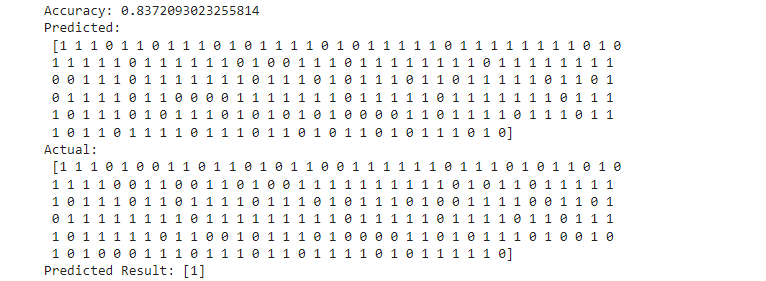

# Implementation-of-Logistic-Regression-Using-Gradient-Descent

## AIM:
To write a program to implement the the Logistic Regression Using Gradient Descent.

## Equipments Required:
1. Hardware – PCs
2. Anaconda – Python 3.7 Installation / Jupyter notebook

## Algorithm
1. Import the necessary python packages
2. Read the dataset.
3. Define X and Y array.
4. Define a function for costFunction,cost and gradient.
5. Define a function to plot the decision boundary and predict the Regression value

## Program:
```
/*
Program to implement the the Logistic Regression Using Gradient Descent.
Developed by: DINESHKARTHIK N
RegisterNumber: 212223220021
*/
import pandas as pd
import numpy as np
data=pd.read_csv("/content/Placement_Data (1).csv")
data.head()
data1=data.copy()
data1.head()
data1=data.drop(['sl_no','salary'],axis=1)
data1
from sklearn.preprocessing import LabelEncoder
le=LabelEncoder()
data1["gender"]=le.fit_transform(data1["gender"])
data1["ssc_b"]=le.fit_transform(data1["ssc_b"])
data1["hsc_b"]=le.fit_transform(data1["hsc_b"])
data1["hsc_s"]=le.fit_transform(data1["hsc_s"])
data1["degree_t"]=le.fit_transform(data1["degree_t"])
data1["workex"]=le.fit_transform(data1["workex"])
data1["specialisation"]=le.fit_transform(data1["specialisation"])
data1["status"]=le.fit_transform(data1["status"])
X=data1.iloc[:,: -1]
Y=data1["status"]
theta=np.random.randn(X.shape[1])
y=Y
def sigmoid(z):
  return 1/(1+np.exp(-z))
def loss(theta,X,y):
  h=sigmoid(X.dot(theta))
  return -np.sum(y*np.log(h)+ (1-y) * np.log(1-h))
def gradient_descent(theta,X,y,alpha,num_iterations):
  m=len(y)
  for i in range(num_iterations):
    h=sigmoid(X.dot(theta))
    gradient=X.T.dot(h-y)/m
    theta-=alpha*gradient
  return theta
theta=gradient_descent(theta,X,y,alpha=0.01,num_iterations=1000)
def predict(theta,X):
  h=sigmoid(X.dot(theta))
  y_pred=np.where(h>=0.5 , 1,0)
  return y_pred
y_pred=predict(theta,X)
accuracy=np.mean(y_pred.flatten()==y)
print("Accuracy:",accuracy)
print("Predicted:\n",y_pred)
print("Actual:\n",y.values)

xnew=np.array([[0,87,0,95,0,2,78,2,0,0,1,0]])
y_prednew=predict(theta,xnew)
print("Predicted Result:",y_prednew)
```

## Output:

ACCURACY,ACTUAL AND PREDICTED VALUES:



PREDICTED RESULT:


## Result:
Thus the program to implement the the Logistic Regression Using Gradient Descent is written and verified using python programming.

